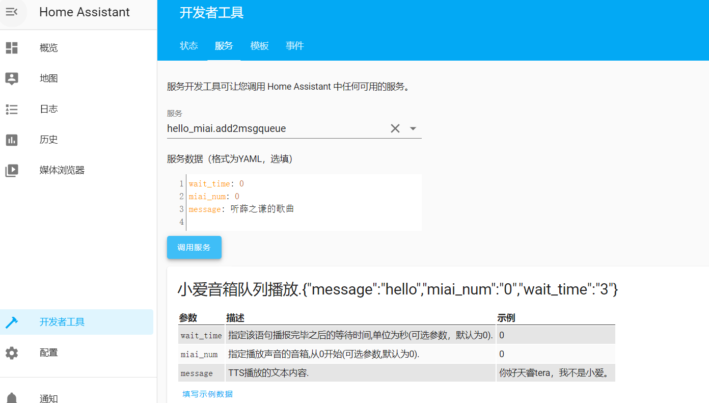

# 本人不是作者，手把手教你使用，在此感谢作者。

目录结构：增加了manifest文件，调整了services文件。将hello_miai文件夹复制到custom_component目录下

```
#定义文件，定义组件的名字所属平台，链接等信息
/your_config/custom_components/hello_miai/manifest.json
#原先的服务插件
/your_config/custom_components/hello_miai/__init__.py
#插件的提示和示例文档
/your_config/custom_components/hello_miai/services.yaml
```

在/your_config/configuration.yaml文件中增加以下内容,填写绑定小爱音箱的用户账号信息：

```
# 小米小爱TTS
hello_miai:
  miid: '13123456789'
  password: 'password'
```

调用服务，如果你有多个音箱，miai_num代表你的音箱id。

```
wait_time: 0
miai_num: 0
message: 你好天睿tera，我不是小爱。
```

重启Home Assistant服务，在开发者工具-服务里，下拉找到hello_miai.add2msgqueue，如果存在则说明配置成功，如果不存在，可能出现错误。



测试方法：选择hello_miai.add2msgqueue，点击填写示例数据，点击调用服务，小爱音箱能播放message的信息则测试成功！


自动化

```
- alias: ShouNengLiang
  initial_state: false
  trigger:
    platform: time
    minutes: /10
    seconds: 0
  condition:
    - condition: time
      after: 07:40:00
      before: 08:10:00
  action:
  - service: hello_miai.force_send
    data_template:
      message: 天猫精灵。
  - delay: 00:00:02
  - service: hello_miai.force_send
    data_template:
      message: 收能量。
```

